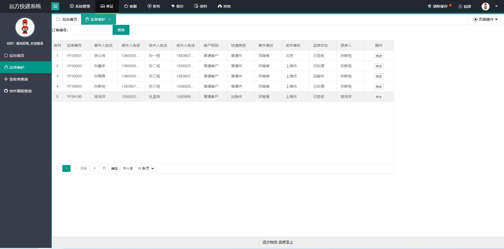

 **郑重声明：项目经过本地测试，确保可以运行， 可以用于学习和毕业设计参考~** 

#### 1.项目介绍
基于SpringBoot的物流管理系统包含三部分：

  - 前台客户下单等操作(微信小程序)
  - 后台物流基本信息维护等操作(PC exe管理系统or B/S管理系统)
  - 快递员扫码枪收发件等操作(微信小程序)

   **附带项目文档说明和部署视频。**
#### 2.本地部署
#####   pc端部署
  - 创建数据库，导入数据库文件
  - IDEA导入项目，修改数据库的配置文件（数据库名、数据库账号和密码）
  - 开启项目，访问 http://localhost:8080  账号/密码： admin/123456, 其他角色账号请查看t_user表

  
##### 小程序端部署
  小程序端分普通用户和快递员两个角色，采用的是微信小程序云函数。
 
 - 打开Hbuildx，导入项目（普通用户和快递员的操作相同），在mainfest.json->微信小程序 ， 修改wxid（测试号无法使用云函数，请自行注册个小程序）
 - 运行->运行到微信小程序模拟器->微信开发工具， 打开项目，注意，要使用云函数
 - 可以免费领取1个月的云开发server

 
 - 右键项目中/functions目录，选择上述步骤中创建的免费云空间
 - 修改云函数中的数据链接属性（云数据库），右键/fuctions/的云函数目录，选择创建并部署（非node_modules）

#### 3.项目部分截图

